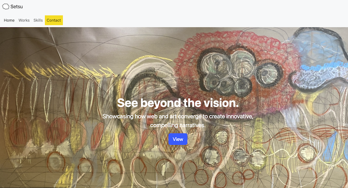

# Bootstrap-Portfolio
This is a  portfolio website using Bootstrap that showcases my work and skills. Using Bootstrap front-end framework, I have built a  visually appealing responsive website. https://setsu-adachi.github.io/bootstrap-portfolio/

## Table of contents
- Requirements
- Installation
- Configuration
- Acknowledgement
- Liense
- Contributing

## Requirements
HTML
CSS
[Bootstrap](https://getbootstrap.com)

## Installation
Clone the repo
git clone https://github.com/Setsu-Adachi/bootstrap-portfolio

## Configuration
https://setsu-adachi.github.io/bootstrap-portfolio/

## Acknowledgement
This project uses [Bootstrap](https://getbootstrap.com/) to create a responsive portfolio website.

## License
Distributed under the MIT License, See LICENSE.txt for more info

## Contributing
If you have any suggestions or improvements, feel free to open an issue or create a pull request. Contributions are welcome!

Enjoy creating your Bootstrap Portfolio. If you have any questions or need help, don't hesitate to reach out. Happy coding!

